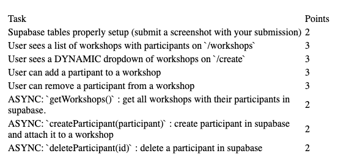

# Plan

1. Database Setup

    - add two tables (workshops & students)

2. Workshops Page

    - getWorkshops function that fetches all of the workshops and their members
    - render function that displays the workshops
    - delete for authenticated users only

3. Create Page

    - create HTML (form with input for name, contact, and placeholder workshop select)
    - get our workshops ( getWorkshops ) and dynamically add option tag
    - add createMember function to fetch-utils
    - add event listener for form submit that grabs new form data and send it to supabase (call createMember)

4. Delete member (on workshops page)
    - create deleteMember(student_id) in fetch-utils
    - add event listener to member el that deletes when clicked

small change
